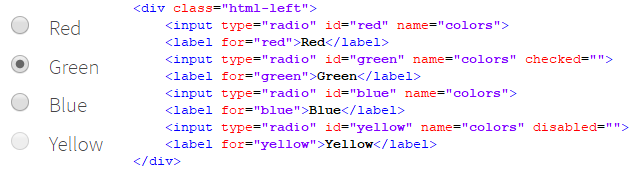
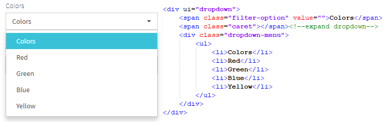

# Documentation
## Extended Selenium features
TBD

## Simple elements
TBD

## Complex elements
### RadioButton

**RadioButton** – interface element that allows user to select one option from a predefined group.

Radio buttons are represented by the following class:
 
  - __Java__: _com.epam.jdi.light.ui.html.complex.RadioButtons_
  - __C#__: _JDI.Light.Elements.Common.RadioButton_

```java 
@UI("[name=colors]")
public static RadioButtons colors;

public static RadioButtons colorsNoLocator;

@Test
public void selectTest() {
    colors.select(Blue);
    assertEquals(colors.getValue(), "Blue");
    colorsNoLocator.select(Red);
    colorsNoLocator.is().selected(Red);
}
```
```csharp 
[Test]
public void SelectRadioButton() 
{
    MyRadioButton.Select("some value");
}
[Test]
public void SelectRadioButtonByIndex() 
{
    MyRadioButton.Select(1);
}
[Test]
public void GetSelected() 
{
    var selected = MyRadioButton.GetSelected();
    Assert.AreEqual(selected, "some value");
}
```

Consider an example where each radio button is a particular color, described with given HTML code:



Here is the list of some available methods:

|Method | Description | Return Type
--- | --- | ---
**select(String/int/Enum)/Select(string/int)** |Select radiobutton by value/index  | void
**selected()/GetSelected()** |Get selected radiobutton value  | string

[Java text examples](https://github.com/jdi-testing/jdi-light/blob/master/jdi-light-html-tests/src/test/java/io/github/epam/html/tests/elements/complex/RadioTests.java)

[C# test examples](https://github.com/jdi-testing/jdi-light-csharp/blob/master/JDI.Light/JDI.Light.Tests/Tests/Common/RadioButtonTests.cs)

### Table
[Test examples](https://github.com/jdi-testing/jdi-light-csharp/blob/master/JDI.Light/JDI.Light.Tests/Tests/Complex/TableTests.cs)

### DropDown

**DropDown** – a graphical control element, that allows the user to choose one value from a list.


JDI Light has support for dropdown elements with its own type. There are several ways of dropdown usage in JDI Light, serving different needs.

__JDI Dropdown annotation__

For better use JDI Light provides a __*@JDropdown*__ annotation to locate dropdown elements. This annotation consists of the following elements:

 - __*root()*__ - value of this element points to the root locator of dropdown element
 - __*value()*__ - locator of selected by default option in dropdown list
 - __*list()*__ - locator representing list options
 - __*expand()*__ - locator for expanding the dropdown list
 
```java 
@JDropdown(root = "div[ui=dropdown]",
           value = ".filter-option",
           list = "li",
           expand = ".caret")
public Droplist colors;

@Test
public void complexTest() {
    metalAndColorsPage.shouldBeOpened();
    metalAndColorsPage.colors.select(Green);
}
```

```csharp 
[JDropDown(root: "#colors", 
           value: ".filter-option", 
           list:"li", 
           expand:".caret")]
public Droplist Colors;

[Test]
public void ComplexTest() 
{
    MetalAndColorsPage.ShouldBeOpened();
    MetalAndColorsPage.Colors.Select(Green);
}
```

Suppose we have 'Colors' dropdown, which looks like this in HTML code:

 

__Dropdown representation__

```java 
public Droplist colors;
@CSS("#colors") public Droplist colors;
public Droplist colors = dropdown("#colors");
public Droplist colors = $d("#colors");

@Test
public void colorsTest() {
    colors.select(Green);
    assertEquals(colors.selected(), Green);
}
```

```csharp 
public DropDown Colors;
[FindBy(Css = "#colors")] 
public DropDown Colors;

[Test]
public void ColorsTest() 
{
    Colors.Select(Green);
    Assert.AreEquals(Colors.Selected(), Green);
}
```

JDI Light provides a __Droplist__ class which can be used for dropdown representation as a type of web element.

Locator simple annotations from *com.epam.jdi.light.elements.pageobjects.annotations.simple* can be used together with dropdown elements.

[Java test examples](https://github.com/jdi-testing/jdi-light/blob/master/jdi-light-examples/src/test/java/io/github/epam/tests/epam/ComplexElementsTests.java)

For HTML5 elements Dropdown lists are also supported in JDI light. There is a __Dropdown__ class which is more like a special case of Droplist.
This type can be used in cases when dropdown is represented with HTML _\<select>_ tag.

Consider an example of HTML5 dropdown with a given HTML code:

```java 
@UI("#dress-code") public Dropdown dressCode;

@Test
public void selectEnumTest() {
    dressCode.select(Fancy);
    assertEquals(dressCode.getValue(), "Fancy");
}
```

```csharp 
[FindBy(Css = "#dress-code")] 
public Dropdown DressCode;

[Test]
public void SelectEnumTest() 
{
    DressCode.Select(Fancy);
    Assert.AreEquals(DressCode.GetSelected(), "Fancy");
}
```


Here is the list of some available methods:

|Method | Description | Return Type
--- | --- | ---
**select()/Select(string/int)** |Select dropdown by value/index  | void
**selected()/GetSelected()** |Get selected dropdown value  | string

[Java test examples](https://github.com/jdi-testing/jdi-light/blob/master/jdi-light-html-tests/src/test/java/io/github/epam/html/tests/elements/complex/DropdownTests.java)

[C# test examples](https://github.com/jdi-testing/jdi-light-csharp/blob/master/JDI.Light/JDI.Light.Tests/Tests/Common/DropDownTests.cs)

### MultiDropDown

```java 
public static MultiSelect multiDropdown;
@UI("#multi-dropdown") public static MultiSelect multiDropdown;

@Test
public void selectTest() {
    multiDropdown.check(Wood, Steam);
    assertEquals(multiDropdown.checked(), asList("Steam", "Wood"));
}
```
```csharp 
[FindBy(Css = "#multi-dropdown")]
public MultiDropdown MultiDropdown { get; set; }

[Test]
public void SelectMultipleOptions()
{
    var optionsList = new List<string> { "Steam", "Electro" };
    TestSite.Html5Page.MultiDropdown.SelectOptions(optionsList);
}
```

**MultiDropDown** – a graphical control element, that allows the user to choose several values from a list.


Multi dropdown elements can be described by the following class:

 - __Java__: _com.epam.jdi.light.ui.html.complex.MultiSelect_
 - __C#__: _JDI.Light.Elements.Composite.MultiDropdown_

Here is the list of some available methods in C# JDI Light:

|Method | Description | Return Type
--- | --- | ---
**OptionIsEnabled(string)** |Check whether option is enabled  | bool
**SelectOption(string)** |Select specified option  | void
**GetSelectedOptions()** |Get selected options  | List
**SelectOptions(List)** |Select specified options  | void
**OptionExists(string)** |Check whether option exists in list  | bool
**Expand()** |Expand list  | void
**Close()** |Close expanded list  | void

The list of available methods for Java JDI Light:

|Method | Description | Return Type
--- | --- | ---
**check(String/String.../Enum.../int...)** |Select values in multi dropdown | void
**uncheck(String.../Enum.../int...)** | Unselect values in multi dropdown | void
**selected()** | Get selected value by default | String
**checked()** | Get selected values | List<String>

[Java text examples](https://github.com/jdi-testing/jdi-light/blob/master/jdi-light-html-tests/src/test/java/io/github/epam/html/tests/elements/complex/MultiDropdownTests.java)

[C# test examples](https://github.com/jdi-testing/jdi-light-csharp/blob/master/JDI.Light/JDI.Light.Tests/Tests/Composite/MultiDropdownTests.cs)

### DataList
```csharp 
[Test]
public void ExpandDataList() 
{
    MyDataList.Expand();
}
[Test]
public void SelectDataList() 
{
    MyDataList.Select("some value");
}
[Test]
public void SelectByIndex() 
{
    MyDataList.Select(1);
}
[Test]
public void FillDataList() 
{
    MyDataList.Input("some value");
    SubmitButton.Click();
}
```
**DataList** – a graphical control element, that allows the user to choose one value from a list or enter it by himself.
Datalist element contains a set of options with values available for entering.


Datalist element type is provided by JDI Light in:

 - __Java__: _com.epam.jdi.light.ui.html.complex.DataList_
 - __C#__: _JDI.Light.Elements.Common.DataList_
 
Have a look at the following example with provided HTML code:

```java 
@UI("#ice-cream") public static DataList iceCreamDataList;

@Test
public void selectEnumTest() {
    iceCreamDataList.select(Strawberry);
    assertEquals(iceCreamDataList.getValue(), "Strawberry");
}
```


The list of available methods in Java JDI Light:

|Method | Description | Return Type
--- | --- | ---
**select(String/Enum/int)** |Select datalist option by value or index | void
**selected()** |Get selected option value | String
**values()** |Get all option values from datalist | List<String>
**listEnabled()** |Return list of values of enabled options | List<String>
**listDisabled()** |Return list of values of disabled options | List<String>

Here is the list of some available methods in C# JDI Light:

|Method | Description | Return Type
--- | --- | ---
**Expand()** |Expands the list of possible values | void
**Select(string/int)** |Select datalist by value/index  | void
**Input(string value)** |Input user's value into datalist  | void
**GetSelected()** |Get selected datalist value  | string

[Java text examples](https://github.com/jdi-testing/jdi-light/blob/master/jdi-light-html-tests/src/test/java/io/github/epam/html/tests/elements/complex/DataListTests.java)

[C# test examples](https://github.com/jdi-testing/jdi-light-csharp/blob/master/JDI.Light/JDI.Light.Tests/Tests/Common/DataListTests.cs)

### CheckList
```java 
TBD !!!!!!111
```
```csharp 
[Test]
public void CheckCheckList() 
{
    MyCheckList.Check("value1", "value2");
    MyCheckList.Uncheck("value2");
}
[Test]
public void CheckByIndexes() 
{
    MyCheckList.Check(1, 3);
    MyCheckList.Uncheck(1);
}
```
**CheckList** – a graphical control element representing a set of checkboxes, each of which allows the user to control a two-state parameter (enabled or disabled).


Here is the list of some available methods:

|Method | Description | Return Type
--- | --- | ---
**Check(string[]/int[])** |Select checklist by values/indexes  | void
**Check(string/int)** |Select checklist by value/index  | void
**Uncheck(string[]/int[])** |Unselect checklist by values/indexes  | void
**Uncheck(string/int)** |Unselect checklist by value/index  | void
**GetChecked()** |Get selected checkboxes from checklist value  | string[]

[Test examples](https://github.com/jdi-testing/jdi-light-csharp/blob/master/JDI.Light/JDI.Light.Tests/Tests/Common/CheckListTests.cs)

### MultiSelector
```java 
TBD
```
```csharp 
[Test]
public void MultiSelectByValues() 
{
    MyMultiSelector.Select(string[]);
}
[Test]
public void MultiSelectByIndexes() 
{
    MyMultiSelector.Select(int[]);
}
```
**MultiSelector** – a graphical control element, that allows the user to do multiple choice.


Here is the list of some available methods:

|Method | Description | Return Type
--- | --- | ---
**Select(string[]/int[])** |Select multiselector by values/indexes  | void
**GetSelected(Array)** |Get selected values  | string[]
**UnselectAll(Array)** |Unselect all values  | void

[Test examples](https://github.com/jdi-testing/jdi-light-csharp/blob/master/JDI.Light/JDI.Light.Tests/Tests/Common/MultiSelectorTests.cs)

### ComboBox
```java 
TBD
```
```csharp 
[Test]
public void ExpandComboBox() 
{
    MyComboBox.Expand();
}
[Test]
public void SelectComboBox() 
{
    MyComboBox.Select("some value");
}
[Test]
public void SelectByIndex() 
{
    MyComboBox.Select(1);
}
[Test]
public void FillComboBox() 
{
    MyComboBox.Input("some value");
    SubmitButton.Click();
}
```
**ComboBox** – a graphical control element, that allows the user to choose one value from a list or enter it by himself (is inherited from the DataList).


Here is the list of some available methods:

|Method | Description | Return Type
--- | --- | ---
**Expand()** |Expands the list of possible values | void
**Select(string/int)** |Select datalist by value/index  | void
**Input(string value)** |Input user's value into datalist  | void
**GetSelected()** |Get selected datalist value  | string

[Test examples](https://github.com/jdi-testing/jdi-light-csharp/blob/master/JDI.Light/JDI.Light.Tests/Tests/Common/ComboBoxTests.cs)

### Input Type Date
```java 
TBD
```
```csharp 
[Test]
public void SetGetDateTime() 
{
    MyDateTime.SetDateTime("2000-01-01");
    MyDateTime.GetValue();
}
```
**Input Type Date** – a graphical control element, that allows the user to set the value of date.


Here is the list of some available methods:

|Method | Description | Return Type
--- | --- | ---
**SetDateTime(string value)** | Sets the date or time | void
**GetValue()** | Returns the set date or time | string

[Test examples](https://github.com/jdi-testing/jdi-light-csharp/blob/master/JDI.Light/JDI.Light.Tests/Tests/Common/DateTimeTests.cs)

### Input Type Week
```java 
TBD
```
```csharp 
[Test]
public void SetGetDateTime() 
{
    MyDateTime.SetDateTime("2019-W11");
    MyDateTime.GetValue();
}
```
**Input Type Week** – a graphical control element, that allows the user to set the value of week and year.


Here is the list of some available methods:

|Method | Description | Return Type
--- | --- | ---
**SetDateTime(string value)** | Sets the date or time | void
**GetValue()** | Returns the set date or time | string

[Test examples](https://github.com/jdi-testing/jdi-light-csharp/blob/master/JDI.Light/JDI.Light.Tests/Tests/Common/DateTimeTests.cs)

### Input Type Month
```java 
TBD
```
```csharp 
[Test]
public void SetGetDateTime() 
{
    MyDateTime.SetDateTime("2019-01");
    MyDateTime.GetValue();
}
```
**Input Type Month** – a graphical control element, that allows the user to set the value of month and year.


Here is the list of some available methods:

|Method | Description | Return Type
--- | --- | ---
**SetDateTime(string value)** | Sets the date or time | void
**GetValue()** | Returns the set date or time | string

[Test examples](https://github.com/jdi-testing/jdi-light-csharp/blob/master/JDI.Light/JDI.Light.Tests/Tests/Common/DateTimeTests.cs)

### Input Type Time
```java 
TBD
```
```csharp 
[Test]
public void SetGetDateTime() 
{
    MyDateTime.SetDateTime("15:00");
    MyDateTime.GetValue();
}
```
**Input Type Time** – a graphical control element, that allows the user to set the value of time.


Here is the list of some available methods:

|Method | Description | Return Type
--- | --- | ---
**SetDateTime(string value)** | Sets the date or time | void
**GetValue()** | Returns the set date or time | string

[Test examples](https://github.com/jdi-testing/jdi-light-csharp/blob/master/JDI.Light/JDI.Light.Tests/Tests/Common/DateTimeTests.cs)


### Input Type DateTime-Local
```java 
TBD
```
```csharp 
[Test]
public void SetGetDateTime() 
{
    MyDateTime.SetDateTime("2000-01-01T12:00");
    MyDateTime.GetValue();
}
```
**Input Type DateTime-Local** – a graphical control element, that allows the user to set the value of time and date.


Here is the list of some available methods:

|Method | Description | Return Type
--- | --- | ---
**SetDateTime(string value)** | Sets the date or time | void
**GetValue()** | Returns the set date or time | string

[Test examples](https://github.com/jdi-testing/jdi-light-csharp/blob/master/JDI.Light/JDI.Light.Tests/Tests/Common/DateTimeTests.cs)

### Input Type Range
```java 
TBD
```
```csharp 
[Test]
public void SetGetRange() 
{
    MyDateTime.SetRange("50");
    MyDateTime.GetValue();
}
```
**Input Type Range** – a graphical control element, that allows the user to set the value from the range.


Here is the list of some available methods:

|Method | Description | Return Type
--- | --- | ---
**SetRange(string value)** | Sets the value | void
**GetValue()** | Returns the set date or time | string

[Test examples](https://github.com/jdi-testing/jdi-light-csharp/blob/master/JDI.Light/JDI.Light.Tests/Tests/Common/RangeTests.cs)

### FileInput
```csharp
[Test]
public void FileInputTest()
{
    FileInput.SelectFile(CreateFile(filename));
}
```
**FileInput** - a grafical control element, that allows the user to upload documents on the web site


|Method | Description | Return Type
--- | --- | ---
**SelectFile(string filepath)** |Select file to upload  | void

[Test examples](https://github.com/jdi-testing/jdi-light-csharp/blob/master/JDI.Light/JDI.Light.Tests/Tests/Common/FileInputTests.cs)

## Composite elements
TBD

## UI Objects
TBD

## JDI Locators
TBD

## Windows/Tabs manager
TBD

## Alerts
```java 
alertButton.click();
acceptAlert();
```
```csharp 
AlertButton.Click();
AcceptAlert();
```
```java 
alertButton.click();
dismissAlert();
```
```csharp 
AlertButton.Click();
DismissAlert();
```
**Alert** –  a window with a message that displays on the screen and pauses the execution of the script until the user performs an action

<aside class="notice">
Note that you can make static import in order to simplify code Alerts.acceptAlert() > acceptAlert()
</aside>

Handle Window alerts/confirm/prompt dialogs desribed on <a href='https://developer.mozilla.org/en-US/docs/Web/API/Window' target="_blank">MDN</a>

alert('Alert')


```java 
alertButton.click();
String text = getAlertText();
acceptAlert();
```
```csharp 
AlertButton.Click();
String text = GetAlertText();
AcceptAlert();
```
```java 
alertButton.click();
validateAlert(is("Red button"));
validateAlert(equalToIgnoringCase("red button"));
validateAlert(containsString("Red"));
```
```csharp 
TBD ValidateAlert
```

confirm()


```java 
alertButton.click();
inputAndAcceptAlert("Some Text");
```
```csharp 
TBD InputAndAcceptAlert
```

prompt('Alert', 'Default value')


## Logs
TBD

## Reports
### Allure
TBD

### Report Portal
TBD

## JDI Settings
TBD

## Driver Settings
TBD

## Parallel tests run
TBD

## Remote test runs
TBD
