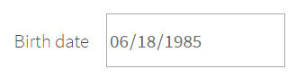
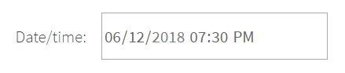
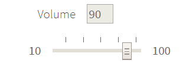

# Documentation
## Extended Selenium features
TBD

## Simple elements
TBD

## Complex elements
### RadioButton
```java 
TBD
```
```csharp 
[Test]
public void SelectRadioButton() 
{
    MyRadioButton.Select("some value");
}
[Test]
public void SelectRadioButtonByIndex() 
{
    MyRadioButton.Select(1);
}
[Test]
public void GetSelected() 
{
    var selected = MyRadioButton.GetSelected();
    Assert.AreEqual(selected, "some value");
}
```
**RadioButton** – interface element that allows user to select one option from a predefined group.


Here is the list of some available methods:

|Method | Description | Return Type
--- | --- | ---
**Select(string/int)** |Select radiobutton by value/index  | void
**GetSelected()** |Get selected radiobutton value  | string

[Test examples](https://github.com/jdi-testing/jdi-light-csharp/blob/master/JDI.Light/JDI.Light.Tests/Tests/Common/RadioButtonTests.cs)

### Table
[Test examples](https://github.com/jdi-testing/jdi-light-csharp/blob/master/JDI.Light/JDI.Light.Tests/Tests/Complex/TableTests.cs)

### DropDown

```csharp 
[Test]
public void SelectDropDownExample() 
{
    MyDropDown.Select("some value");
}
[Test]
public void SelectByIndexExample() 
{
    MyDropDown.Select(1);
}
[Test]
public void GetSelectedExample() 
{
    var selected = MyDropDown.GetSelected();
    Assert.AreEqual(selected, "some value");
}
```
**DropDown** – a graphical control element, that allows the user to choose one value from a list.


JDI has support for dropdown elements with its own type. 

Suppose we have 'Colors' dropdown presented in the picture. It looks like this in HTML code:

```java 
@JDropdown(root = "div[ui=dropdown]",
           value = ".filter-option",
           list = "li",
           expand = ".caret")
public static Droplist colors;


@Test
public void complexTest() {
    metalAndColorsPage.shouldBeOpened();
    metalAndColorsPage.colors.select(Green);
}
```


Here is the list of some available methods:

|Method | Description | Return Type
--- | --- | ---
**Select(string/int)** |Select dropdown by value/index  | void
**GetSelected()** |Get selected dropdown value  | string

[Test examples](https://github.com/jdi-testing/jdi-light-csharp/blob/master/JDI.Light/JDI.Light.Tests/Tests/Common/DropDownTests.cs)

### MultiDropDown

```java 
TBD
```
```csharp 
[Test]
public void ExpandMultiDropdown()
{
    TestSite.Html5Page.MultiDropdown.Expand();
}

[Test]
public void SelectMultipleOptions()
{
    var optionsList = new List<string> { "Steam", "Electro" };
    TestSite.Html5Page.MultiDropdown.SelectOptions(optionsList);
}

[Test]
public void CheckOptionExists()
{
    TestSite.Html5Page.MultiDropdown.Expand();
    Jdi.Assert.IsTrue(TestSite.Html5Page.MultiDropdown.OptionExists("Steam"));
}

[Test]
public void CheckOptionIsDisabled()
{
    TestSite.Html5Page.MultiDropdown.Expand();
    Jdi.Assert.IsFalse(TestSite.Html5Page.MultiDropdown.OptionIsEnabled("Disabled"));
}
```
**MultiDropDown** – a graphical control element, that allows the user to choose several values from a list.


Here is the list of some available methods:

|Method | Description | Return Type
--- | --- | ---
**OptionIsEnabled(string)** |Check whether option is enabled  | bool
**SelectOptionByname(string)** |Select specified option  | void
**GetSelectedOptions()** |Get selected options  | List
**SelectOptions(List)** |Select specified options  | void
**OptionExists(string)** |Check whether option exists in list  | bool
**Expand()** |Expand list  | void
**Close()** |Close expanded list  | void

[Test examples](https://github.com/jdi-testing/jdi-light-csharp/blob/master/JDI.Light/JDI.Light.Tests/Tests/Composite/MultiDropdownTests.cs)

### DataList
```java 
TBD
```
```csharp 
[Test]
public void ExpandDataList() 
{
    MyDataList.Expand();
}
[Test]
public void SelectDataList() 
{
    MyDataList.Select("some value");
}
[Test]
public void SelectByIndex() 
{
    MyDataList.Select(1);
}
[Test]
public void FillDataList() 
{
    MyDataList.Input("some value");
    SubmitButton.Click();
}
```
**DataList** – a graphical control element, that allows the user to choose one value from a list or enter it by himself.


Here is the list of some available methods:

|Method | Description | Return Type
--- | --- | ---
**Expand()** |Expands the list of possible values | void
**Select(string/int)** |Select datalist by value/index  | void
**Input(string value)** |Input user's value into datalist  | void
**GetSelected()** |Get selected datalist value  | string

[Test examples](https://github.com/jdi-testing/jdi-light-csharp/blob/master/JDI.Light/JDI.Light.Tests/Tests/Common/DataListTests.cs)

### CheckList
```java 
TBD
```
```csharp 
[Test]
public void CheckCheckList() 
{
    MyCheckList.Check("value1", "value2");
    MyCheckList.Uncheck("value2");
}
[Test]
public void CheckByIndexes() 
{
    MyCheckList.Check(1, 3);
    MyCheckList.Uncheck(1);
}
```
**CheckList** – a graphical control element representing a set of checkboxes, each of which allows the user to control a two-state parameter (enabled or disabled).


Here is the list of some available methods:

|Method | Description | Return Type
--- | --- | ---
**Check(string[]/int[])** |Select checklist by values/indexes  | void
**Check(string/int)** |Select checklist by value/index  | void
**Uncheck(string[]/int[])** |Unselect checklist by values/indexes  | void
**Uncheck(string/int)** |Unselect checklist by value/index  | void
**GetChecked()** |Get selected checkboxes from checklist value  | string[]

[Test examples](https://github.com/jdi-testing/jdi-light-csharp/blob/master/JDI.Light/JDI.Light.Tests/Tests/Common/CheckListTests.cs)

### MultiSelector
```java 
TBD
```
```csharp 
[Test]
public void MultiSelectByValues() 
{
    MyMultiSelector.Select(string[]);
}
[Test]
public void MultiSelectByIndexes() 
{
    MyMultiSelector.Select(int[]);
}
```
**MultiSelector** – a graphical control element, that allows the user to do multiple choice.


Here is the list of some available methods:

|Method | Description | Return Type
--- | --- | ---
**Select(string[]/int[])** |Select multiselector by values/indexes  | void
**GetSelected(Array)** |Get selected values  | string[]
**UnselectAll(Array)** |Unselect all values  | void

[Test examples](https://github.com/jdi-testing/jdi-light-csharp/blob/master/JDI.Light/JDI.Light.Tests/Tests/Common/MultiSelectorTests.cs)

### ComboBox
```java 
TBD
```
```csharp 
[Test]
public void ExpandComboBox() 
{
    MyComboBox.Expand();
}
[Test]
public void SelectComboBox() 
{
    MyComboBox.Select("some value");
}
[Test]
public void SelectByIndex() 
{
    MyComboBox.Select(1);
}
[Test]
public void FillComboBox() 
{
    MyComboBox.Input("some value");
    SubmitButton.Click();
}
```
**ComboBox** – a graphical control element, that allows the user to choose one value from a list or enter it by himself (is inherited from the DataList).


Here is the list of some available methods:

|Method | Description | Return Type
--- | --- | ---
**Expand()** |Expands the list of possible values | void
**Select(string/int)** |Select datalist by value/index  | void
**Input(string value)** |Input user's value into datalist  | void
**GetSelected()** |Get selected datalist value  | string

[Test examples](https://github.com/jdi-testing/jdi-light-csharp/blob/master/JDI.Light/JDI.Light.Tests/Tests/Common/ComboBoxTests.cs)

### Input Type Date
```java 
TBD
```
```csharp 
[Test]
public void SetGetDateTime() 
{
    MyDateTime.SetDateTime("2000-01-01");
    MyDateTime.GetValue();
}
```
**Input Type Date** – a graphical control element, that allows the user to set the value of date.



Here is the list of some available methods:

|Method | Description | Return Type
--- | --- | ---
**SetDateTime(string value)** | Sets the date or time | void
**GetValue()** | Returns the set date or time | string

[Test examples](https://github.com/jdi-testing/jdi-light-csharp/blob/master/JDI.Light/JDI.Light.Tests/Tests/Common/DateTimeTests.cs)

### Input Type Week
```java 
TBD
```
```csharp 
[Test]
public void SetGetDateTime() 
{
    MyDateTime.SetDateTime("2019-W11");
    MyDateTime.GetValue();
}
```
**Input Type Week** – a graphical control element, that allows the user to set the value of week and year.


Here is the list of some available methods:

|Method | Description | Return Type
--- | --- | ---
**SetDateTime(string value)** | Sets the date or time | void
**GetValue()** | Returns the set date or time | string

[Test examples](https://github.com/jdi-testing/jdi-light-csharp/blob/master/JDI.Light/JDI.Light.Tests/Tests/Common/DateTimeTests.cs)

### Input Type Month
```java 
TBD
```
```csharp 
[Test]
public void SetGetDateTime() 
{
    MyDateTime.SetDateTime("2019-01");
    MyDateTime.GetValue();
}
```
**Input Type Month** – a graphical control element, that allows the user to set the value of month and year.


Here is the list of some available methods:

|Method | Description | Return Type
--- | --- | ---
**SetDateTime(string value)** | Sets the date or time | void
**GetValue()** | Returns the set date or time | string

[Test examples](https://github.com/jdi-testing/jdi-light-csharp/blob/master/JDI.Light/JDI.Light.Tests/Tests/Common/DateTimeTests.cs)

### Input Type Time
```java 
TBD
```
```csharp 
[Test]
public void SetGetDateTime() 
{
    MyDateTime.SetDateTime("15:00");
    MyDateTime.GetValue();
}
```
**Input Type Time** – a graphical control element, that allows the user to set the value of time.


Here is the list of some available methods:

|Method | Description | Return Type
--- | --- | ---
**SetDateTime(string value)** | Sets the date or time | void
**GetValue()** | Returns the set date or time | string

[Test examples](https://github.com/jdi-testing/jdi-light-csharp/blob/master/JDI.Light/JDI.Light.Tests/Tests/Common/DateTimeTests.cs)


### Input Type DateTime-Local
```java 
TBD
```
```csharp 
[Test]
public void SetGetDateTime() 
{
    MyDateTime.SetDateTime("2000-01-01T12:00");
    MyDateTime.GetValue();
}
```
**Input Type DateTime-Local** – a graphical control element, that allows the user to set the value of time and date.



Here is the list of some available methods:

|Method | Description | Return Type
--- | --- | ---
**SetDateTime(string value)** | Sets the date or time | void
**GetValue()** | Returns the set date or time | string

[Test examples](https://github.com/jdi-testing/jdi-light-csharp/blob/master/JDI.Light/JDI.Light.Tests/Tests/Common/DateTimeTests.cs)

### Input Type Range
```java 
TBD
```
```csharp 
[Test]
public void SetGetRange() 
{
    MyDateTime.SetRange("50");
    MyDateTime.GetValue();
}
```
**Input Type Range** – a graphical control element, that allows the user to set the value from the range.



Here is the list of some available methods:

|Method | Description | Return Type
--- | --- | ---
**SetRange(string value)** | Sets the value | void
**GetValue()** | Returns the set date or time | string

[Test examples](https://github.com/jdi-testing/jdi-light-csharp/blob/master/JDI.Light/JDI.Light.Tests/Tests/Common/RangeTests.cs)

### FileInput
```csharp
[Test]
public void FileInputTest()
{
    FileInput.SelectFile(CreateFile(filename));
}
```
**FileInput** - a grafical control element, that allows the user to upload documents on the web site


|Method | Description | Return Type
--- | --- | ---
**SelectFile(string filepath)** |Select file to upload  | void

[Test examples](https://github.com/jdi-testing/jdi-light-csharp/blob/master/JDI.Light/JDI.Light.Tests/Tests/Common/FileInputTests.cs)

## Composite elements
TBD

## UI Objects
TBD

## JDI Locators
TBD

## Windows/Tabs manager
TBD

## Alerts
```java 
alertButton.click();
acceptAlert();
```
```csharp 
AlertButton.Click();
AcceptAlert();
```
```java 
alertButton.click();
dismissAlert();
```
```csharp 
AlertButton.Click();
DismissAlert();
```
**Alert** –  a window with a message that displays on the screen and pauses the execution of the script until the user performs an action

<aside class="notice">
Note that you can make static import in order to simplify code Alerts.acceptAlert() > acceptAlert()
</aside>

Handle Window alerts/confirm/prompt dialogs desribed on <a href='https://developer.mozilla.org/en-US/docs/Web/API/Window' target="_blank">MDN</a>

alert('Alert')


```java 
alertButton.click();
String text = getAlertText();
acceptAlert();
```
```csharp 
AlertButton.Click();
String text = GetAlertText();
AcceptAlert();
```
```java 
alertButton.click();
validateAlert(is("Red button"));
validateAlert(equalToIgnoringCase("red button"));
validateAlert(containsString("Red"));
```
```csharp 
TBD ValidateAlert
```

confirm()


```java 
alertButton.click();
inputAndAcceptAlert("Some Text");
```
```csharp 
TBD InputAndAcceptAlert
```

prompt('Alert', 'Default value')


## Logs
TBD

## Reports
### Allure
TBD

### Report Portal
TBD

## JDI Settings
TBD

## Driver Settings
TBD

## Parallel tests run
TBD

## Remote test runs
TBD
